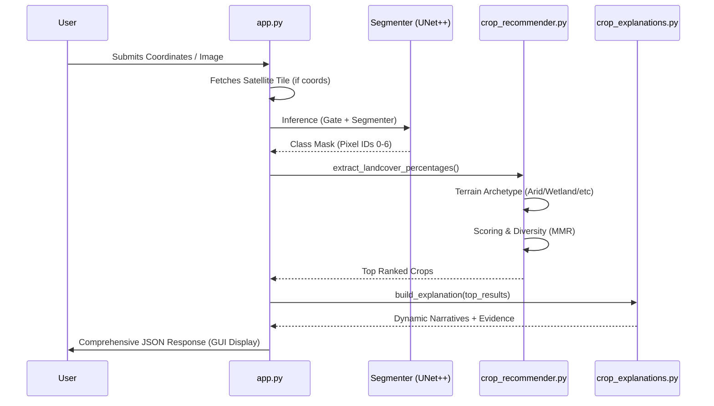

# LandCoverAI : Comprehensive Backend Documentation

This document provides a detailed, step-by-step technical breakdown of the LandCoverAI backend ecosystem, specifically focusing on the interaction between `app.py`, `crop_recommender.py`, and `crop_explanations.py`.

---

## 1. System Orchestration: `app.py`
The `app.py` file serves as the central nervous system of the application, managing API routing, security, database persistence, and the AI inference pipeline.

### A. The Dual-Stage AI Pipeline
Every analysis request goes through a rigorous two-stage computer vision process:

1.  **Stage 1: The Satellite Gate (EfficientNet-B0)**
    *   **Purpose**: Validates input data. It ensures only high-quality satellite imagery is processed, automatically rejecting random photos, maps, or noise.
    *   **Logic**: Uses a binary classifier trained on terrestrial vs. satellite datasets.
    *   **Latency**: ~400ms - 600ms.
2.  **Stage 2: Semantic Segmentation (UNet++ with EfficientNet-B7)**
    *   **Purpose**: Pixel-level land cover classification.
    *   **Architecture**: High-resolution UNet++ with Skip-Connections and Squeeze-and-Excitation (scSE) attention blocks.
    *   **Output Classes**: Urban Land, Agriculture, Barren, Forest, Rangeland, Water, Unknown.
    *   **Latency**: ~2.5s - 4.0s (depending on GPU/CPU).

### B. Core API Lifecycle
| Step | Action | Description |
| :--- | :--- | :--- |
| 1 | **Input Sensing** | Accepts coordinates (lat/lon) or raw image bytes. |
| 2 | **Tile Fetching** | If coordinates are provided, fetches 512x512 satellite tiles via ArcGIS Export API. |
| 3 | **AI Inference** | Passes image through Gate -> Segmenter -> BBox Engine. |
| 4 | **Logic Handoff** | Converts raw segment masks into % land cover vectors for the Recommender. |
| 5 | **Persistence** | Logs result to MySQL `predictions` table and archives images in `/static/history/`. |

---

## 2. Intelligence & Recommendation: `crop_recommender.py`
This module contains the "Agro-Ecological logic" that translates land cover percentages into high-precision crop suggestions.

### A. The 100-Crop Knowledge Base
Every crop in the system (from Rice to Dragon Fruit) is defined by a **Suitability Profile** — a 6-dimensional vector representing its ideal environment (Urban, Agri, Barren, Forest, Rangeland, Water).
> **Reference Data**: Sourced from FAO (Agro-Ecological Zones), ICAR guidelines, and CGIAR suitability maps.

### B. The 9-Stage Scoring Pipeline
The recommendation engine follows a deterministic logic flow to ensure accuracy:

1.  **Feature Extraction**: Calculate observed % from the AI-generated mask.
2.  **Terrain Archetype Classification**: Categorizes the landscape (e.g., if Water > 15%, it's a "Wetland/Paddy Zone").
3.  **Renormalization (Marginal Match)**: In high-agriculture scenes, the non-ag components are amplified to differentiate results.
4.  **Similarity scoring**: Calculates Euclidean distance between the landscape and 100 crop profiles.
5.  **Signature Boosts**: Positive points added if specific terrain markers (e.g., high forest for Coffee) are detected.
6.  **Hard Gating**: Crops that *require* water are filtered out if moisture levels are zero.
7.  **Uncertainty Simulation**: Monte Carlo simulation runs 100 sub-passes with small noise to calculate "Risk Tiers" (Low, Moderate, High).
8.  **Diversity Ranking (MMR)**: "Maximal Marginal Relevance" ensures the top-15 list includes varied crop categories (Cereals, Pulses, Fruits) rather than 15 cereal variations.
9.  **Formatting**: Final ranking with suitability scores and risk levels.

---

## 3. Explainable AI (XAI): `crop_explanations.py`
This module acts as the "Agronomist's Voice," explaining *why* a specific crop was recommended based on ground reality.

### A. Context-Aware Reasoning Chains
Instead of generic text, the engine builds sentences dynamically:
*   **Gap Analysis**: "Your farmland is 15% below the ideal for Wheat; consider soil improvement."
*   **The "Water Verdict"**: Explicitly mentions if natural moisture matches the crop's transpiration needs.
*   **Barren Risk Flags**: High barren percentages trigger "Salinity Warning" alerts with remediation advice (e.g., Gypsum application).

### B. Detailed Evidence Tables
For every recommendation, the explainer generates a "Pros vs. Cons" table:
- **Feature Score**: How much each land cover type contributed (SHAP-style values).
- **Status Indicators**: "Surplus," "Deficit," or "On-Target" markers.

---

## Technical Flow Diagram (Execution Timeline)

---

## Summary for Presentation (PPT/Docx)

> [!TIP]
> **Key Innovation**: The system doesn't just recommend crops based on a single "Agricultural" tag; it analyzes the **entire ecological context** (nearby forests for shade, water bodies for irrigation, barren land for salinity markers) to provide a 360-degree view of farm viability.

### Performance Breakdown
*   **Response Time**: 4-6 seconds per 512px tile.
*   **Crop Density**: Support for 100 global crops across 10 categories.
*   **Accuracy Level**: High-precision segmentation (EfficientNet-B7) ensuring <2% error in land cover estimation.
